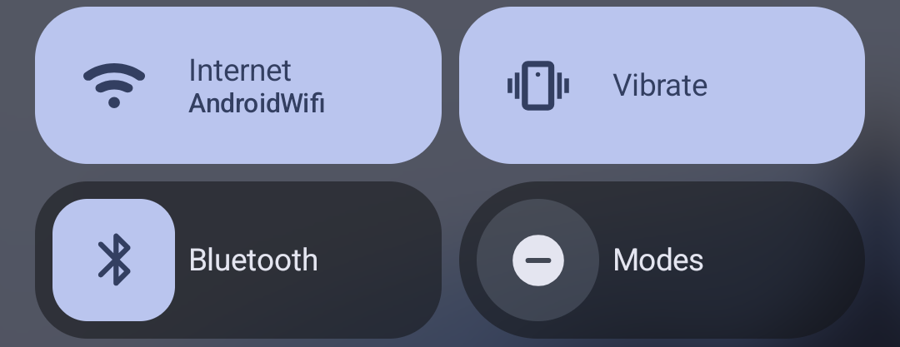
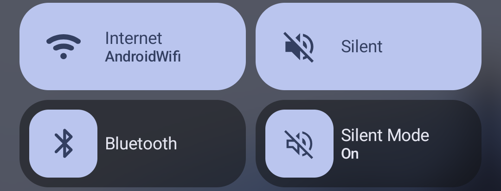

# Sound Modes 🎵

A lightweight Android utility designed for AOSP and Pixel devices that add the missing **Quick Settings tile** for switching sound profiles.

On modern Pixel phones, users are forced to use physical volume buttons to change ringer modes. **Sound Modes** solves this by adding a toggle directly to your notification shade to cycle through **Normal, Vibrate, and Mute**.

This project was inspired by the [Sound-Toggle](https://github.com/grmasa/Sound-Toggle) and was rebuilt from the ground up in Kotlin as a fun project to learn modern Android development.

---

## ✨ Features
- **Quick Settings Tile:** Cycle through Sound, Vibrate, and Mute with one tap.

  

- **Android 15 (API 35) Optimized:** Specifically designed for the latest Android versions.
- **Multilingual:** Full support for **English** and **Polish**.

## 🛠️ Requirements
- **Android 15 (API 35):** Required for the [AutomaticZenRule.Builder](https://developer.android.com/reference/android/app/AutomaticZenRule.Builder) implementation.
- **Access Notification Policy:** The app requires "Do Not Disturb" access to change ringer states.

---

## 👨‍💻 Credits & Learning
This app was created as an educational exercise. Special thanks to [grmasa](https://github.com/grmasa) for the original [Sound-Toggle](https://github.com/grmasa/Sound-Toggle) concept.

## 📄 License
This project is licensed under the [GNU GPLv3](https://www.gnu.org/licenses/gpl-3.0.html) - see the [LICENSE](LICENSE) file for details.
