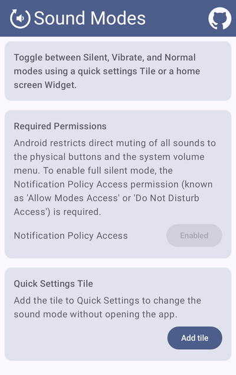
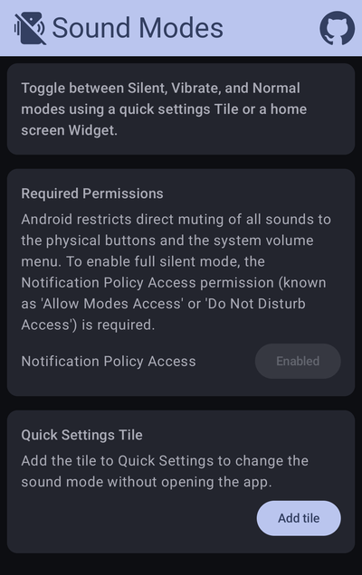
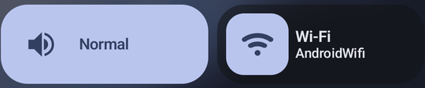
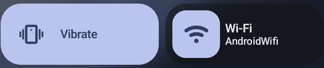
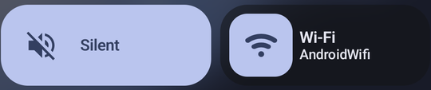
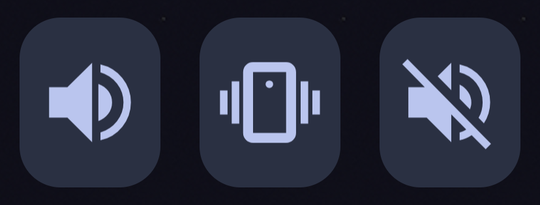
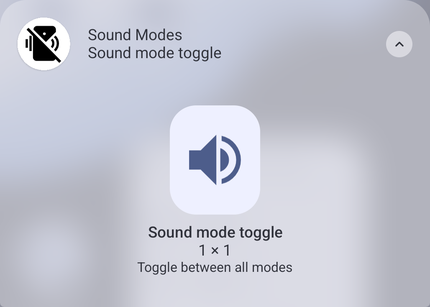
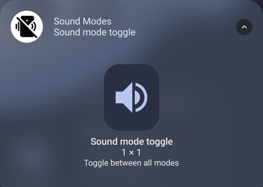

# Sound Modes 🎵

A lightweight Android utility designed for AOSP and Pixel devices that adds the missing **Quick Settings tile** for switching sound profiles.

On modern Pixel phones, users are forced to use physical volume buttons to change ringer modes. **Sound Modes** solves this by adding a toggle directly to your notification shade to cycle through **Normal, Vibrate, and Silent**.

This project was inspired by the [Sound-Toggle](https://github.com/grmasa/Sound-Toggle) and was rebuilt from the ground up in Kotlin as a fun project to learn modern Android development.

---

  
  

## ✨ Features
- **Quick Settings Tile:** Cycle through Normal, Vibrate, and Silent with one tap. The tile always shows the current mode, even when the mode is changed with the volume buttons.

   
   
  
- **One-tap tile setup:** Add the tile to Quick Settings straight from the app with the **Add tile** button, without editing the Quick Settings panel. Once the tile is added, the button shows **Tile added**.
- **Home screen widget:** A 1×1 resizable widget built with Jetpack Glance. One tap switches to the next mode. It shows the current mode, also after a change with the volume buttons or the tile, and uses the Material You colors of your wallpaper.

  

   
- **Works without the app running:** The tile and the widget work even when the app is closed, including on **Android 17**, which blocks sound mode changes from background apps.
- **Silent means silent:** Silent mode is a "Do Not Disturb" mode that lets only alarms through. It appears as *Silent Mode* in the system **Modes** settings.
- **Light and dark theme:** The app follows the system theme and Material You dynamic colors.
- **Lightweight and private:** No ads, no tracking and no internet access. The release APK is under 3 MB.
- **Multilingual:** Full support for **English** and **Polish**.

## 📲 Installation
1. Download the APK from the [Releases](https://github.com/helsing85/SoundModes/releases) page, or build it yourself (see [Building](#%EF%B8%8F-building)).
2. Open **Sound Modes** and tap **Enable** in the *Required Permissions* card. Allow **Do Not Disturb / Modes access** for Sound Modes in the system settings.
3. Tap **Add tile** to put the tile in Quick Settings, and/or add the **Sound Modes** widget from the home screen widget picker.

## 🛠️ Requirements
- **Android 15 (API 35) or newer:** Required for the [AutomaticZenRule.Builder](https://developer.android.com/reference/android/app/AutomaticZenRule.Builder) implementation. Fully supports Android 17.
- **Notification Policy Access:** The app needs "Do Not Disturb" access to switch on Silent mode.

## 🔐 Permissions
| Permission | Why it is needed |
|---|---|
| Notification Policy Access | Turning on Silent mode, which is implemented as a "Do Not Disturb" mode. |
| Foreground service (special use) | Since Android 17, apps can change the sound mode only while they are visible or running a foreground service. The app runs a short foreground service for a moment after you tap the tile or the widget. |
| Vibrate | A short vibration when switching to Vibrate mode. |
| Run at startup | Refreshing the widget after the phone restarts. |

## 🏗️ Building
- **Tools:** Android Studio with JDK 17 or newer
- **Stack:** Kotlin 2.4, Jetpack Compose (Material 3), Jetpack Glance, Android Gradle Plugin 9, compile and target SDK 37
- **Build a release APK:** `./gradlew assembleRelease`. The APK is written to `app/build/outputs/apk/release/SoundModes_v<version>-release.apk`.
- **Run unit tests:** `./gradlew testDebugUnitTest`
- R8 code and resource shrinking is enabled for release builds. The release build is signed with the local **debug key**, so it can be installed over debug builds. It is not suitable for Google Play.

---

## 👨‍💻 Credits & Learning
This app was created as an educational exercise. Special thanks to [grmasa](https://github.com/grmasa) for the original [Sound-Toggle](https://github.com/grmasa/Sound-Toggle) concept.

## 📄 License
This project is licensed under the [GNU GPLv3](https://www.gnu.org/licenses/gpl-3.0.html) - see the [LICENSE](LICENSE) file for details.
